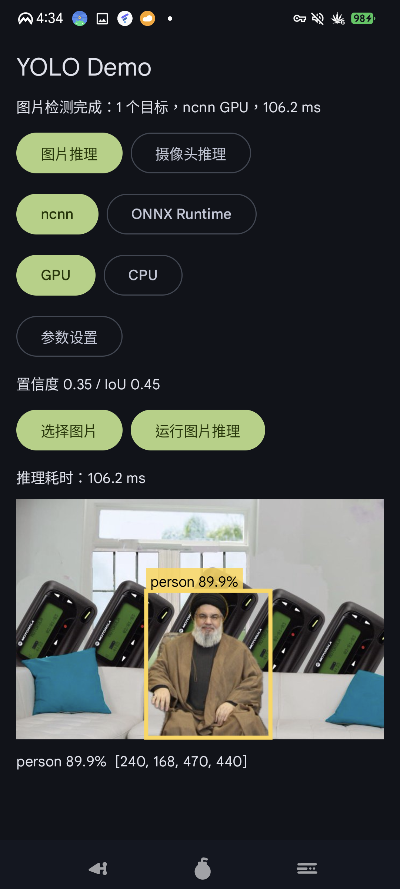

# YOLO Android Demo

这个项目是一个使用 Kotlin + Jetpack Compose 编写的 Android YOLO 推理 demo。当前已经接入三种推理后端：

- ncnn：通过 C++ JNI 调用，支持 CPU 和 Vulkan GPU。
- ONNX Runtime Android：通过 Kotlin 直接调用，支持 CPU 和 Android NNAPI 加速尝试。
- LiteRT / TensorFlow Lite：通过 Kotlin 直接调用，支持 CPU 和 Android NNAPI 加速尝试。

应用支持图片推理和摄像头实时推理，可以在界面上切换推理后端、CPU/GPU 或 NNAPI、置信度阈值和 IoU 阈值。



## 功能

- 图片推理：从系统相册选择图片，运行 YOLO 检测并显示结果图。
- 摄像头实时推理：使用 CameraX 获取后置摄像头画面，实时检测并绘制检测框。
- 推理后端切换：支持 `ncnn`、`ONNX Runtime` 和 `LiteRT`。
- 模型类型显示与切换：ncnn 和 LiteRT 支持 `float32 / int8` 模型切换，ONNX Runtime 当前显示固定 `float32` 类型。
- ncnn CPU / GPU：默认使用 GPU，GPU 失败时提示并自动切换到 CPU。
- ONNX Runtime CPU / NNAPI：ONNX Runtime 的加速按钮显示为 `NNAPI`。如果当前模型或设备不支持 NNAPI，会提示并自动切换到 CPU。
- LiteRT CPU / NNAPI：LiteRT 的加速按钮同样显示为 `NNAPI`，失败时会提示并自动切换到 CPU。
- 开始 / 暂停摄像头推理：摄像头模式下需要手动开始，可以暂停或恢复分析帧。
- 置信度和 IoU 阈值设置：界面提供可折叠的阈值设置区域。
- 结果可视化：检测框左上角显示类别名和置信度。
- 性能显示：在图片或视频上方显示单帧推理耗时，摄像头模式额外显示 FPS。
- 模型配置读取：ncnn 和 LiteRT 从 `metadata.yaml` 读取输入尺寸和类别名称；ONNX Runtime 从 ONNX metadata 读取 `imgsz` 和 `names`。
- App 图标：使用根目录 `logo.png` 生成的 adaptive launcher icon。

## 编程环境

推荐环境：

- Windows 11
- Android Studio
- Android Gradle Plugin 9.2.1
- Kotlin Compose plugin 2.2.10
- Gradle Wrapper
- Android SDK compileSdk 36.1
- Android minSdk 27
- JDK：使用 Android Studio 自带 JBR
- Android NDK + CMake
- ncnn Android Vulkan SDK：`ncnn-20260526-android-vulkan`

## Android 依赖

主要 Android/Kotlin 依赖在 `gradle/libs.versions.toml` 和 `app/build.gradle.kts` 中维护：

- Jetpack Compose BOM `2026.02.01`
- Material 3
- Activity Compose
- Core KTX
- Lifecycle Runtime KTX
- CameraX `1.5.1`
  - `camera-core`
  - `camera-camera2`
  - `camera-lifecycle`
- ONNX Runtime Android `1.26.0`
- TensorFlow Lite `2.17.0`
- JUnit / AndroidX Test / Espresso

Native 侧依赖：

- C++17
- Android `jnigraphics`
- Android `log`
- ncnn
- Vulkan GPU 推理能力由 ncnn Android Vulkan 包提供

当前构建 ABI：

- `arm64-v8a`
- `armeabi-v7a`

## ncnn SDK 放置方式

当前仓库不内置 ncnn Android SDK。请下载 ncnn Android Vulkan 预编译包，解压后放到：

```text
app/src/main/cpp/ncnn-android-vulkan/
```

期望目录结构类似：

```text
app/src/main/cpp/ncnn-android-vulkan/
  arm64-v8a/
    include/
    lib/cmake/ncnn/ncnnConfig.cmake
  armeabi-v7a/
    include/
    lib/cmake/ncnn/ncnnConfig.cmake
```

如果这个目录不存在，CMake 会编译 JNI stub，App 可以启动，但推理时会提示需要配置 ncnn SDK。

## 模型文件

### ncnn 模型

当前 ncnn float32 模型资产目录：

```text
app/src/main/assets/yolo26n_ncnn_model/
  model.ncnn.param
  model.ncnn.bin
  metadata.yaml
```

当前 ncnn int8 量化模型资产目录：

```text
app/src/main/assets/yolo26n_ncnn_model_int8/
  model.ncnn.param
  model.ncnn.bin
  metadata.yaml
```

`metadata.yaml` 中至少需要包含：

- `imgsz`：模型输入尺寸，例如 `[640, 640]`
- `names`：类别 id 到类别名的映射

界面在 ncnn 后端下支持 `float32 / int8` 模型类型切换。切换模型类型时会销毁当前 ncnn detector 并重新加载对应 assets 目录中的模型。

ncnn 输出解析支持两类格式：

- `[300, 6]` 或 `[6, 300]`：end-to-end 输出，格式按 `[x1, y1, x2, y2, score, classId]` 解析。
- `[84, 8400]` 或 `[8400, 84]`：YOLO raw head 输出，格式按 `[cx, cy, w, h, class_scores...]` 解析，并在 C++ 侧执行 NMS。

ncnn JNI 包装类：

```text
app/src/main/java/com/example/yolo_app/detector/NcnnYoloDetector.kt
```

C++ ncnn 实现：

```text
app/src/main/cpp/ncnn_yolo_jni.cpp
```

### ncnn int8 量化

ncnn int8 量化参考官方文档：

- [quantized-int8-inference.md](https://github.com/Tencent/ncnn/blob/master/docs/how-to-use-and-FAQ/quantized-int8-inference.md)

量化工具来自 ncnn `20260526` release 的 Windows 预编译包：

- [ncnn 20260526 release](https://github.com/Tencent/ncnn/releases/tag/20260526)
- [ncnn-20260526-windows-vs2022.zip](https://github.com/Tencent/ncnn/releases/download/20260526/ncnn-20260526-windows-vs2022.zip)

使用到的工具：

- `ncnn2table.exe`
- `ncnn2int8.exe`

示例量化流程：

```powershell
# 一般标准化的计算是 (x - mean) / norm
# 而 ncnn 标准化是 (x - mean) * norm
# yolo 标准化的 mean = [0,0,0], norm = [255,255,255]
# 在这里就是 mean = [0,0,0], norm = [0.003922,0.003922,0.003922] # 0.003922 ≈ 1 / 255
.\ncnn2table.exe model.ncnn.param model.ncnn.bin imagelist.txt model.ncnn.table mean=[0,0,0] norm=[0.003922,0.003922,0.003922] shape=[640,640,3] pixel=RGB thread=8 method=kl
```

```powershell
.\ncnn2int8.exe model.ncnn.param model.ncnn.bin model.ncnn-int8.param model.ncnn-int8.bin model.ncnn.table
```

生成后将 int8 模型复制到：

```text
app/src/main/assets/yolo26n_ncnn_model_int8/
```

并保持 App 期望的文件名：

```text
model.ncnn.param
model.ncnn.bin
metadata.yaml
```

### ONNX Runtime 模型

当前 ONNX 模型资产目录：

```text
app/src/main/assets/yolo26n_onnx_model/
  model.onnx
```

ONNX Runtime 封装类：

```text
app/src/main/java/com/example/yolo_app/detector/OnnxYoloDetector.kt
```

ONNX 模型要求：

- 输入默认按 `FLOAT [1, 3, H, W]` 处理，图像预处理为 RGB、letterbox、归一化到 `0..1`。
- 从 ONNX metadata 读取 `imgsz` 和 `names`。
- 支持两类输出：
  - `[1, 300, 6]`：end-to-end 输出，格式按 `[x1, y1, x2, y2, score, classId]` 解析。
  - `[1, 84, 8400]` 或 `[1, 8400, 84]`：YOLO raw head 输出，格式按 `[cx, cy, w, h, class_scores...]` 解析，并在 Kotlin 侧执行 NMS。

当前 int8 量化 ONNX 模型会输出 raw head `[1, 84, 8400]`。原因是量化后的 end-to-end 后处理会把类别分数分支压成 0，导致 `[1, 300, 6]` 的 score 全部为 0；因此项目将该模型的输出改到后处理前，并在 App 侧解析和 NMS。

### LiteRT / TFLite 模型

当前 LiteRT / TFLite float32 模型资产目录：

```text
app/src/main/assets/yolo26n_tflite_model/
  model.tflite
  metadata.yaml
```

当前 LiteRT / TFLite int8 量化模型资产目录：

```text
app/src/main/assets/yolo26n_tflite_model_int8/
  model.tflite
  metadata.yaml
```

LiteRT 封装类：

```text
app/src/main/java/com/example/yolo_app/detector/LiteRtYoloDetector.kt
```

当前 TFLite float32 模型实际输入输出：

- 输入：`FLOAT [1, 640, 640, 3]`，NHWC，RGB，letterbox，归一化到 `0..1`。
- 输出：`FLOAT [1, 300, 6]`。

当前 TFLite int8 模型实际输入输出：

- 输入：`FLOAT [1, 640, 640, 3]`，NHWC，RGB，letterbox，归一化到 `0..1`。
- 输出：`FLOAT [1, 84, 8400]`。

界面在 LiteRT 后端下支持 `float32 / int8` 模型类型切换。切换模型类型时会销毁当前 LiteRT detector 并重新加载对应 assets 目录中的 `model.tflite`。

LiteRT 推理代码会自动识别输入和输出 dtype，支持：

- float32
- uint8
- int8

LiteRT 输出解析支持：

- `[1, 300, 6]`：end-to-end 输出，格式按 `[x1, y1, x2, y2, score, classId]` 解析。
- `[1, 84, 8400]` 或 `[1, 8400, 84]`：YOLO raw head 输出，格式按 `[cx, cy, w, h, class_scores...]` 解析，并在 Kotlin 侧执行 NMS。

## ONNX Runtime 使用说明

ONNX Runtime Android 通过 Maven 依赖引入：

```kotlin
implementation(libs.onnxruntime.android)
```

LiteRT / TensorFlow Lite 通过 Maven 依赖引入：

```kotlin
implementation(libs.tensorflow.lite)
```

界面中的 ONNX Runtime 和 LiteRT 设备选项：

- `CPU`：使用 CPU 推理。
- `NNAPI`：调用 Android NNAPI 加速。NNAPI 是否真正使用 GPU/NPU/CPU 由手机系统、芯片驱动和模型算子支持情况决定。

已知情况：

- 当前测试设备上，ONNX Runtime NNAPI 会因为模型中的部分节点不被支持而失败。
- App 会捕获 ONNX Runtime / LiteRT 的 NNAPI 失败，显示短提示，并自动切换到 CPU。
- ncnn 的 `GPU` 是 Vulkan 路径，和 ONNX Runtime / LiteRT 的 `NNAPI` 不是同一种加速方式。

## 推理流程

1. Kotlin UI 获取图片或 CameraX 视频帧。
2. 根据 EXIF 或 CameraX rotation 信息修正图像方向。
3. 根据界面选择调用 `NcnnYoloDetector.detect(...)`、`OnnxYoloDetector.detect(...)` 或 `LiteRtYoloDetector.detect(...)`。
4. 按模型输入尺寸进行 letterbox 预处理。
5. 调用对应后端执行推理。
6. 解析 YOLO 输出，执行置信度过滤和 NMS。
7. 返回 Kotlin `Detection` 列表。
8. Compose Canvas 绘制检测框、类别和分数。
9. 在预览上方显示耗时和 FPS。

模型不是每次检测都重新载入。App 会按当前后端和设备类型维护 detector 实例，第一次推理时创建并加载模型，之后复用；切换后端、切换 CPU/GPU/NNAPI 或释放资源时才会销毁并重建。

## 构建

在项目根目录执行：

```powershell
$env:hTTP_PROXY="http://127.0.0.1:7890"
$env:HTTPS_PROXY="http://127.0.0.1:7890"
$env:JAVA_HOME="C:\Program Files\Android\Android Studio\jbr"
$env:Path="$env:JAVA_HOME\bin;$env:Path"
.\gradlew.bat assembleDebug
```

构建成功后 APK 位于：

```text
app/build/outputs/apk/debug/app-debug.apk
```

## 安装到设备

连接 Android 设备并确认 adb 可见：

```powershell
adb devices
```

安装 debug APK：

```powershell
adb install -r app/build/outputs/apk/debug/app-debug.apk
```

启动应用：

```powershell
adb shell am start -n com.example.yolo_app/.MainActivity
```

如果摄像头权限没有自动弹出或需要手动授权：

```powershell
adb shell pm grant com.example.yolo_app android.permission.CAMERA
```

## 主要文件

```text
app/src/main/java/com/example/yolo_app/MainActivity.kt
app/src/main/java/com/example/yolo_app/detector/Detection.kt
app/src/main/java/com/example/yolo_app/detector/NcnnYoloDetector.kt
app/src/main/java/com/example/yolo_app/detector/OnnxYoloDetector.kt
app/src/main/java/com/example/yolo_app/detector/LiteRtYoloDetector.kt
app/src/main/cpp/ncnn_yolo_jni.cpp
app/src/main/cpp/ncnn_yolo_stub_jni.cpp
app/src/main/cpp/CMakeLists.txt
app/src/main/assets/yolo26n_ncnn_model/
app/src/main/assets/yolo26n_ncnn_model_int8/
app/src/main/assets/yolo26n_onnx_model/
app/src/main/assets/yolo26n_tflite_model/
app/src/main/assets/yolo26n_tflite_model_int8/
images/demo.png
```

## 当前限制

- 摄像头实时推理当前使用后置摄像头。
- ONNX Runtime 的 `NNAPI` 并不等价于 Vulkan GPU，是否可用取决于设备和模型算子支持。
- 当前 ONNX int8 模型使用 raw head 输出并在 Kotlin 侧做 NMS。如果替换 ONNX 模型，请确认输出 shape 是 `[1,300,6]`、`[1,84,8400]` 或 `[1,8400,84]`。
- ncnn、ONNX Runtime 和 LiteRT 使用各自的模型文件，替换模型时需要分别更新对应 assets 目录。
